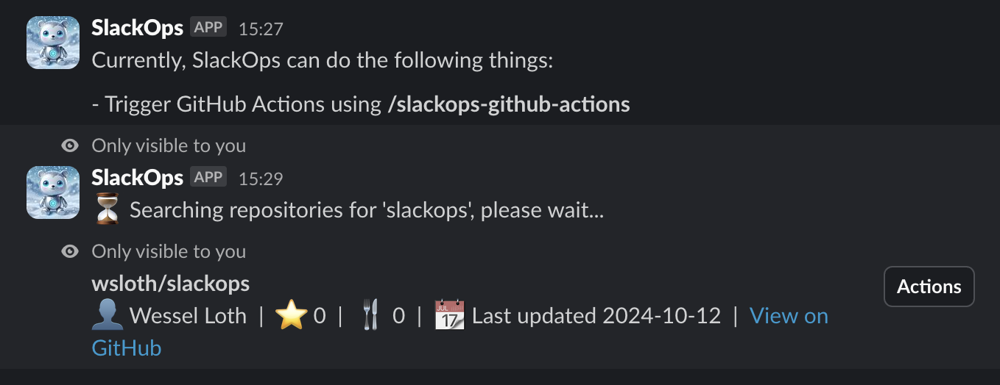
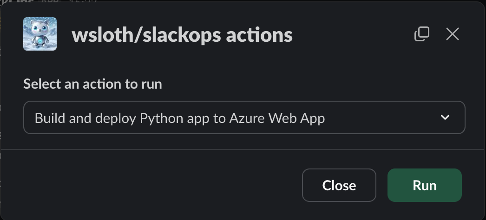

# SlackOps Bot

This repository contains a Slack bot to help you easily automate stuff!

## Current features

The SlackOps bot can currently help you do the following things:
- List or search through (connected) GitHub repositories
- Trigger GitHub actions easily directly from Slack

## Local Development

### First time setup
1. Create an Ngrok account (https://ngrok.com/download)
    - Follow the steps on the Ngrok site the Ngrok CLI and set your auth token
    - Tip: Set up a persistent URL in Ngrok so you do not need to update your Slack app settings every time you restart Ngrok
1. Set up the Slack app
    - Visit https://api.slack.com/apps/
    - Copy your Ngrok URL into the Slack app settings
1. Copy `.env.example` into `.env` and add your tokens
    - Enter your Slack API credentials
    - Set up a GitHub auth token as described in the `.env` file

### Running the bot
1. Run `ngrok http 3000`
1. Run `python3 app.py` in a separate process
